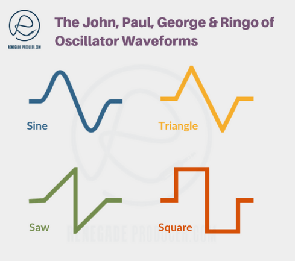
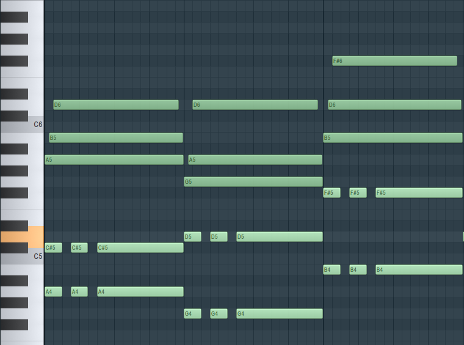

# Research

Работа с музыкальными данными может быть проблематичной. Если собрать датасет, то надо найти открытые аудиозаписи, без всяких сложностей с правами автора и т.д. или же неофициальным образом скачать себе. 

Есть ещё вариант записать самому, НО сочинять музыку, играть, записать, чистить от шума, это все нужно сделать если планируем сделать музыкальную запись. Это хочется делать ради творчества, а не, чтобы обучить нейронную, которая заменит тебя музыкального… 

Таким образом можно сделать вывод, что найти способ генерировать музыкальные данные стоит.

## Способы генерации

В сфере музыки есть несколько способов генерации синтетических данных.

1. **MIDI (Musical Instrument Digital Interface):** MIDI-файлы содержат информацию о музыкальных нотах, высоте тона, длительности и других параметрах, но не содержат фактического звука. Эти наборы данных могут быть синтезированы с помощью программного обеспечения для генерации звуков. 
    
    
    
2. **Audio Synthesis:** Наборы данных могут быть созданы с использованием методов синтеза звука, при которых звуки генерируются искусственно с использованием алгоритмов. Это может включать такие методы, как аддитивный синтез, субтрактивный синтез, синтез с частотной модуляцией или синтез физического моделирования для получения аудиоданных. В конце концов, звук — колебания, физические волны, необязательно нужно иметь музыкальные инструменты, чтобы их создать. 
    
    
    
3. **Generative Models:** Как и везде (почти), методы машинного обучения и искусственного интеллекта на месте, для создания синтетических музыкальных данных используются генеративные модели, такие как вариационные автоэнкодеры (VAE), генеративные состязательные сети (GAN) или трансформаторы. Эти модели изучают шаблоны из существующих наборов музыкальных данных и генерируют новые (+-) оригинальные композиции.

## Примеры приложений синтетических музыкальных инструментов

Кроме использования исскуственно сгенерированных звуков в своей музыке, нас интересует больше приложения в Data Science: 

- **Audio Source Separation:** Достаточно интересная и популярная задача ML в аудио. Допустим что мы разрабатываем сервис для разделения музыкальных партий, или для совершенствования треков. В таком случае нам нужно обучить модель для детекции отдельных звуков. Вместо того, чтобы пойти записать в студии все дорожки вместе, потом отдельно. Можно дома в своей любимой программе записи генерировать партии разных инеструментов.
- **Audio Classification:** Исскуственно можно снежать тональность, ускорить или замедлить, таким образом можно получить новую версию одной песни, но при этом классификация не меняется. То есть если мы обучаем модель для классификации жанров, то можем получить ещё одну запись в датасете, исскуственно меняв оргинальную запись.

## Интересные модели и сервисы

### Magenta

[Magenta](https://magenta.tensorflow.org/)

> **An open source research project exploring the role of machine learning as a tool in the creative process.**
> 

Magenta - это исследовательский проект с открытым исходным кодом, разработанный командой из Google Brain, который фокусируется на изучении пересечения искусственного интеллекта (ИИ) и креативности, особенно в области создания музыки и искусства. Он направлен на развитие методов машинного обучения, позволяющих машинам создавать привлекательный и оригинальный художественный контент.

Такие библиотеки, как Magenta от Google или Usenet от OpenAI, могут создавать наборы данных на основе MIDI.

### MuseNet

[MuseNet](https://openai.com/research/musenet)

> Мы создали MuseNet, глубокую нейронную сеть, которая может генерировать 4-минутные музыкальные композиции с использованием 10 различных инструментов и может сочетать стили от кантри до Моцарта и The Beatles. MuseNet не был явно запрограммирован с учетом нашего понимания музыки, но вместо этого обнаружил закономерности гармонии, ритма и стиля, научившись предсказывать следующий токен в сотнях тысяч MIDI-файлов. Muse Net использует ту же универсальную неконтролируемую технологию, что и GPT-2, крупномасштабную модель-трансформер, обученную предсказывать следующий токен в последовательности, будь то аудио или текст.
>
